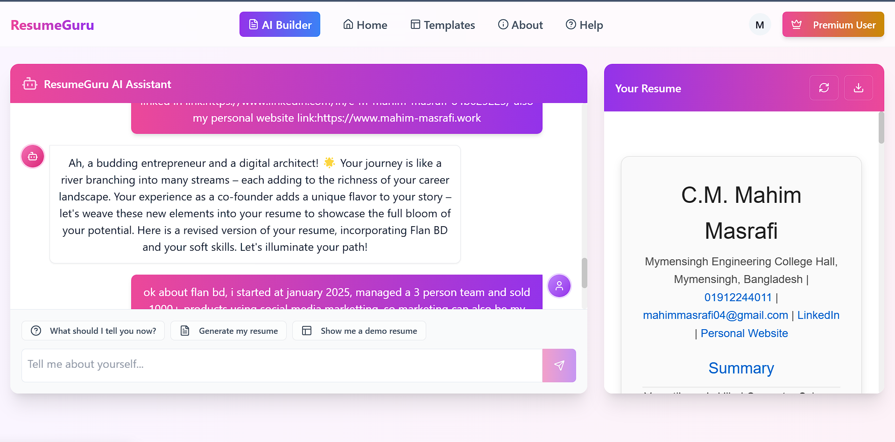

# ResumeGuru - AI-Powered Resume Builder

<div align="center">
  
  <p><em>Transform your career journey with AI-powered resume creation</em></p>
</div>

## 📱 App Screenshots

### Resume Builder Interface

*Interactive AI chat interface with real-time resume preview*

### Full Landing Page View

*Complete application interface*

### Resume Templates

*Professional resume templates to choose from*

## 🌟 Features

- 🤖 **AI-Powered Resume Generation**
  - Interactive chat interface for natural resume creation
  - Smart information collection and organization
  - Real-time resume preview as you chat

- 📱 **Modern, Responsive Design**
  - Beautiful gradient UI elements
  - Smooth animations and transitions
  - Mobile-friendly interface

- 🎨 **Professional Templates**
  - Multiple ATS-friendly templates
  - Customizable designs
  - Professional formatting

- 🔒 **Secure & Reliable**
  - Secure authentication
  - Auto-save functionality
  - Data encryption

- 💾 **Smart Features**
  - Progress tracking
  - Helper suggestions
  - Quick resume sections

## 🚀 Getting Started

### Prerequisites

- Node.js (v18 or higher)
- npm or yarn
- Supabase account (for authentication)

### Installation

1. Clone the repository:
```bash
git clone https://github.com/ThisIsMahim/resume-guru.git
cd resume-guru
```

2. Install dependencies:
```bash
npm install
# or
yarn install
```

3. Set up environment variables:
```bash
cp .env.example .env
```
Fill in your Supabase credentials in the `.env` file.

4. Start the development server:
```bash
npm run dev
# or
yarn dev
```

## 🛠️ Tech Stack

- **Frontend**: React + TypeScript
- **UI Framework**: Tailwind CSS + shadcn/ui
- **Authentication**: Supabase Auth
- **State Management**: React Query
- **Styling**: Tailwind CSS + Framer Motion
- **Form Handling**: React Hook Form
- **API Integration**: n8n Workflows

## 📝 Project Structure

```
resume-guru/
├── src/
│   ├── components/     # Reusable UI components
│   ├── pages/         # Page components
│   ├── hooks/         # Custom React hooks
│   ├── lib/           # Utility functions
│   └── types/         # TypeScript type definitions
├── public/            # Static assets
└── n8n/              # n8n workflow configurations
```

## 🔒 Security Features

- End-to-end encryption for sensitive data
- Secure authentication flow
- GDPR compliant
- Regular security audits

## 🤝 Contributing

Contributions are welcome! Please feel free to submit a Pull Request.

1. Fork the repository
2. Create your feature branch (`git checkout -b feature/AmazingFeature`)
3. Commit your changes (`git commit -m 'Add some AmazingFeature'`)
4. Push to the branch (`git push origin feature/AmazingFeature`)
5. Open a Pull Request

## 🙏 Acknowledgments

- [Supabase](https://supabase.com/) for authentication
- [n8n](https://n8n.io/) for workflow automation
- [shadcn/ui](https://ui.shadcn.com/) for beautiful UI components

---

<div align="center">
  Made with ❤️ by C.M. Mahim Masrafi
</div>
